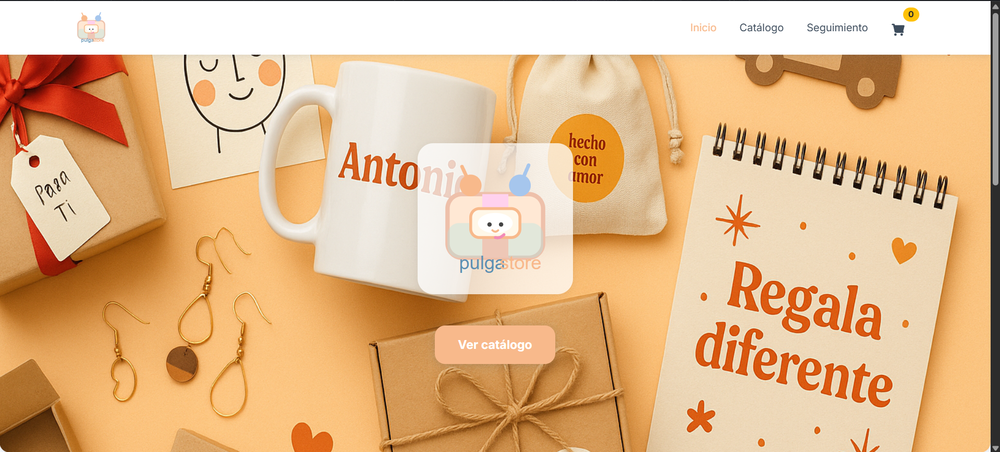
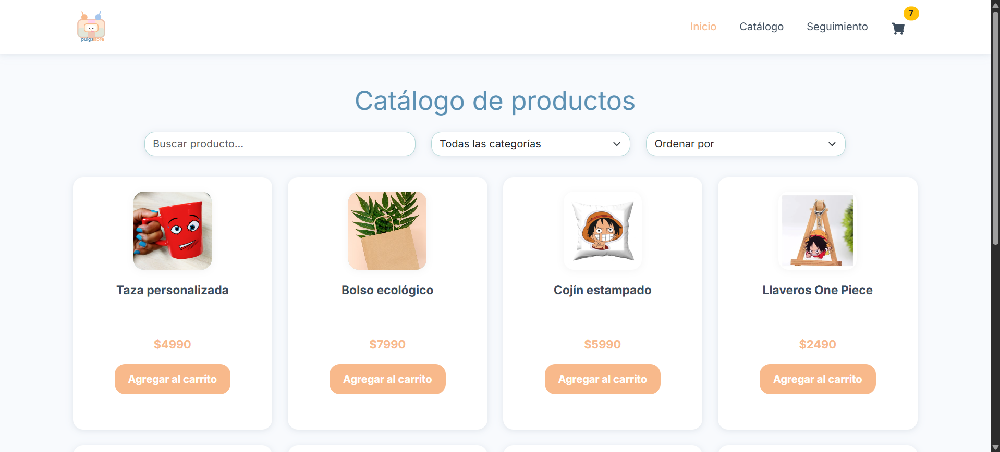
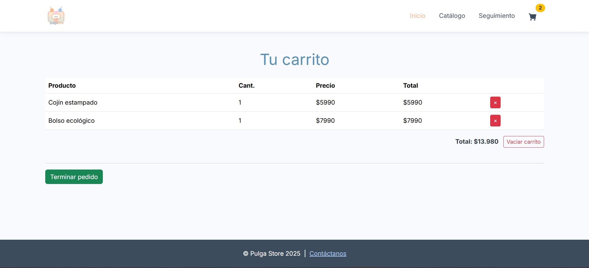
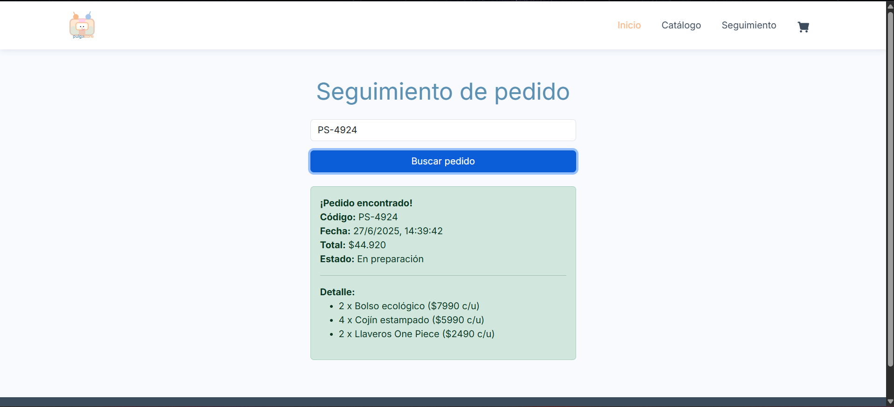

  

# Pulga Store 🛒

¡Bienvenido/a a **Pulga Store**!  
Tienda web de regalos personalizados y detalles únicos, desarrollada como proyecto final para el módulo de desarrollo web Frontend.

---

## 🚀 Demo

*Abre el archivo `index.html` directamente en tu navegador para comenzar.*

---

## 🖥️ Tecnologías utilizadas

- **HTML5, CSS3**  
- **Bootstrap 5** (navbar, footer, cards, carousel, modals, tooltips)
- **Bootstrap Icons** (iconos de redes sociales)
- **LocalStorage** para persistir carrito y órdenes de compra
- **jQuery + toastr.js** para notificaciones

---

## 🧩 Principales funcionalidades

- **Catálogo de productos** filtrable y paginado (con estructura de datos por requerimiento)
- **Carrito de compras** persistente (LocalStorage), permite agregar, eliminar productos y vaciar carrito
- **Página de ventas**: ver y seleccionar productos con cards Bootstrap
- **Formulario modal** que solicita nombre y apellido al usuario, mostrando el saludo en la navbar de toda la web
- **Generación y seguimiento de órdenes**: código único de seguimiento y detalle del pedido
- **Loader animado** con el logo mientras carga la página
- **Carousel de Bootstrap** mostrando productos destacados
- **Tooltips de Bootstrap** en el icono del carrito 
- **Iconos de redes sociales** en el footer
- **Responsive**: Adaptada a móvil, tablet y desktop
- **Diseño personalizado, limpio y profesional**

---

## 📝 ¿Cómo probar?

1. **Descarga o clona este repositorio.**
2. **Abre `index.html`** en tu navegador.
3. Prueba las funcionalidades:
   - Ingresa tu nombre y apellido en el modal.
   - Navega por el catálogo, filtra y ordena productos.
   - Agrega productos al carrito, usa los tooltips.
   - Ve a “Carrito” (pedidos.html), elimina productos, vacía el carrito o termina el pedido.
   - Copia el código de seguimiento generado.
   - Ve a “Seguimiento”, pega el código para ver el detalle.
   - Haz clic en los iconos de redes sociales en el footer.
4. Recarga la página: verás que el carrito y las órdenes persisten gracias a LocalStorage.

---

## 📸 Capturas
### Inicio

### Catálogo

### Carrito de compras

### Seguimiento de pedido

---

## 👨‍💻 Autor

- **Desarrollador:** Sebastian Palacios Vera

---

**Proyecto realizado como evaluación final para el módulo 4 “Fundamentos de Programación en JavaScript”.**  
Cumple todos los requerimientos solicitados por la rúbrica del curso.

